# Mona Dierickx (202187997)

- [x] Web Services: 2324-webservices-monadierickx
  - <[Github repo link](https://github.com/Web-IV/2324-webservices-monadierickx)>
  - <[Online versie API](https://webservices-monadierickx.onrender.com/)>

**Logingegevens**

Admins: 
- E-mailadres: 'alice@mail.be'
- Wachtwoord: 'verydifficult'

- E-mailadres: 'bella@mail.be'
- Wachtwoord: 'verydifficult'

Member: 
- E-mailadres: 'celine@mail.be'
- Wachtwoord: 'verydifficult'

## Projectbeschrijving

Deze applicatie is gemaakt voor het vergemakkelijken van eventplanning. Er is specifiek vertrokken van het idee van een studentenkring die regelmatig evenementen organiseert op verschillende locaties en een gemakkelijkere manier zoekt om in te plannen wie komt helpen op welk evenement. 

De applicatie is toepasbaar in verschillende use cases waar een organisatie evenementen inplant op verschillende locaties en samenwerkt met leden die niet allemaal naar elk evenement komen. 

De bedoeling is dat een lid een evenement kan organiseren en dat andere leden zich op de staff lijst van dat evenement kunnen zetten. Daarbij moet dus per evenement die lijst van *on staff members* bekeken kunnen worden. Als lid kan je zelf ook een overzicht vragen van de evenementen waar je naartoe gaat. 

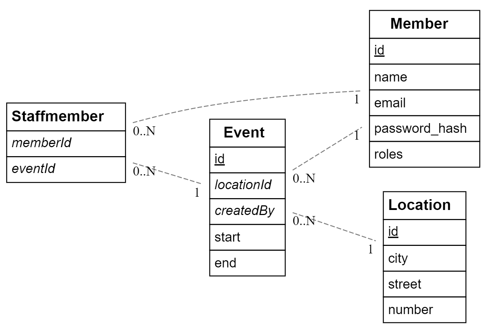

### Event
Elk evenment heeft een **id**, een **start**- en een **einduur**, een **locatieID**, die verwijst naar een locatie, een **createdBy**, die verwijst naar een creator en een lijst van **staff**, die verwijst naar de tussentabel staffmember. 

Het **start- en einduur** zijn elk *by default* het moment waarop het evenement gecreëerd wordt. Het is aangewezen dit beide te veranderen naar het juiste tijdstip. 

De **locatie** is het adres waar het evenement zal plaatsvinden. 

De **creator** is het lid dat het evenement heeft aangemaakt. Dit lid is de verantwoordelijke van het evenement. Enkel de creator of een admin kunnen de creator (en dus verantwoordelijke) van een evenement aanpassen. Dit is vooral nodig wanneer een lid de organisatie verlaat en zijn account verwijdert. Op dat moment worden namelijk alle evenementen waarvoor het lid verantwoordelijk was verwijderd. 

Elk element in de **staff** lijst verwijst naar een staffmember, die elk verwijzen naar een lid dat heeft aangegeven te helpen op het evenement. Elk lid kan maar één keer op de lijst van staffmembers staan. Elk lid kan aangeven dat die wilt komen helpen op het evenement en kan zich vervolgens van de lijst halen, indien die toch niet komt helpen op het evenement. 

### Member 

Een member (lid) heeft een **id**, eventueel een naam (**name**), een uniek e-mailadres (**email**), een **password hash**, een lijst van **roles**, een lijst van **onStaff**, die verwijst naar de tussentabel staffmember en een **createdEvents** die verwijst naar een lijst evenementen. 

De **password hash** is de versleutelde versie van het wachtwoord waarmee het lid zich geregistreerd heeft. Deze wordt gebruikt om het wachtwoord waarmee een gebruiker probeert aan te melden te controleren. Dit is privé en moet opgeslagen worden in de databank, maar zal nooit getoond worden wanneer informatie over het lid wordt opgevraagd. 

De **roles** bevatten een lijst van strings. Elk lid is zeker een "member", maar de admins hebben de rol "member" en de rol "admin". Dit geeft hun toegang tot bepaalde acties. 

De **onStaff** is een lijst van staffmember entiteiten die verwijzen naar de evenementen voor dewelke een lid heeft aangegeven dat hij zal komen helpen. Een member kan altijd een lijst opvragen van alle evenementen waarop die heeft aangegeven dat die zal komen helpen. Een "member" kan dit enkel voor zichzelf, een "admin" voor elk lid. 

De **createdEvents** is een lijst van evenementen die het lid heeft gemaakt en waarvoor die dus verantwoordelijk is. 

### Location 

Een location heeft een **id**, een **city** (stad), **street** (straat), **number** (huisnummer) en **events**, die verwijst naar een lijst van de evenementen die plaatsvinden op de locatie. 

Het **id** is uniek en de *primary key*, maar ook de combinatie van **city**, **street** en **number** is uniek. Anders zou hetzelfde adres meerdere keren kunnen worden opgeslagen in de databank met een verschillend id. Dat zou het zinloos maken om de lijst van evenementen op een locatie op te vragen. 

De **events** worden meegegeven wanneer de informatie van een locatie wordt opgevraagd. 

Enkel een admin kan een locatie verwijderen, omdat het verwijderen van een locatie alle evenementen die plaatsvinden op die locatie zal verwijderen. Dit is bedoeld voor situaties waarin een bepaalde locatie niet meer toegankelijk is voor de organisatie. 

### Staffmember 
Dit is een tussentabel waarnaar dus geen rechtstreekse API-calls zullen worden uitgevoerd. Deze tussentabel heeft maar twee kolommen: **eventId**, die verwijst naar het event waarop dit lid komt helpen en **memberId**, die verwijst naar het lid dat op dat evenement komt helpen. 
De combinatie **eventId** en **memberId** moet steeds uniek zijn, gezien eenzelfde lid maar één keer op eenzelfde evenement aanwezig kan zijn. Deze combinatie is de *primary key* van de staffmember table. 

## API calls

### Members

- `POST api/members/register`: een gebruiker moet zich kunnen registreren als lid.
- `POST api/members/login`: een gebruiker moet zich kunnen aanmelden als lid en/of admin. 
- `GET api/members`: een **admin** moet alle leden kunnen bekijken. 
- `GET api/members/:id`: een **admin** of het lid zelf moet de informatie van een lid kunnen bekijken. 
- `PUT api/members/:id`: een **admin** of het lid zelf moet de informatie van een lid kunnen aanpassen. 
- `DELETE api/members/:id`: een **admin** of het lid zelf moet de informatie van een lid kunnen verwijderen. 
- `GET api/members/:memberId/staffmembers`: een **admin** of het lid zelf moet de evenementen kunnen bekijken waar die komt helpen. 

### Events

- `GET api/events`: een lid moet alle evenmenten kunnen bekijken.
- `POST api/events`: een lid moet een evenement kunnen toevoegen. 
- `GET api/events/:id`: een lid moet een evenement kunnen bekijken. 
- `PUT api/events/:id`: een lid moet een evenement kunnen aanpassen waarvan die creator is, een admin moet elk evenement kunnen aanpassen. 
- `DELETE api/events/:id`: een lid moet een evenement kunnen verwijderen waarvan die creator is, een admin moet elk evenement kunnen verwijderen. 
- `GET api/events/:eventId/staffmembers`: een lid moet kunnen bekijken wie komt helpen op een specifiek evenement. 
- `POST api/events/:eventId/staffmembers`: een lid moet kunnen aangeven dat die zelf komt helpen op een specifiek evenement. 
- `DELETE api/events/:eventId/staffmembers/:id`: een lid moet kunnen verwijderen dat die zelf toch niet komt helpen op het evenement en een admin moet dit kunnen voor elk lid. 

### Locations 

- `GET api/locations/`: een lid moet alle locaties kunnen bekijken. 
- `POST api/locations/`: een lid moet een locatie kunnen toevoegen. 
- `GET api/locations/:id`: een lid moet een locatie kunnen bekijken met alle evenementen. 
- `PUT api/locations/:id`: een lid moet een locatie kunnen aanpassen. 
- `DELETE api/locations/:id`: een **admin** moet een locatie kunnen verwijderen.

### Staffmembers
Niet van toepassing! We doen geen API-calls naar een tussentabel. 

## Behaalde minimumvereisten - Web Services

- **datalaag**

  - [x] voldoende complex (meer dan één tabel, 2 een-op-veel of veel-op-veel relaties)
  - [x] één module beheert de connectie + connectie wordt gesloten bij sluiten server
  - [x] heeft migraties - indien van toepassing
  - [x] heeft seeds
 

- **repositorylaag** --> Niet van toepassing, Prisma ORM gebruikt 

  - [ ] definieert één repository per entiteit (niet voor tussentabellen) - indien van toepassing
  - [ ] mapt OO-rijke data naar relationele tabellen en vice versa - indien van toepassing
 

- **servicelaag met een zekere complexiteit**

  - [x] bevat alle domeinlogica
  - [x] bevat geen SQL-queries of databank-gerelateerde code
 

- **REST-laag**

  - [x] meerdere routes met invoervalidatie
  - [x] degelijke foutboodschappen
  - [x] volgt de conventies van een RESTful API
  - [x] bevat geen domeinlogica
  - [x] geen API calls voor entiteiten die geen zin hebben zonder hun ouder (bvb tussentabellen)
  - [x] degelijke authorisatie/authenticatie op alle routes
 

- **algemeen**

  - [x] er is een minimum aan logging voorzien
  - [x] een aantal niet-triviale integratietesten (min. 1 controller >=80% coverage)
  - [x] minstens één extra technologie 
  - [x] maakt gebruik van de laatste ES-features (async/await, object destructuring, spread operator...)
  - [x] duidelijke en volledige README.md
  - [x] volledig en tijdig ingediend dossier en voldoende commits

## Projectstructuur - Web Services

### Root folder 
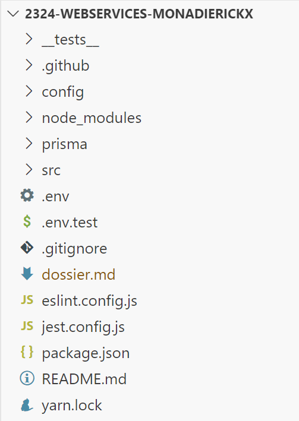

Deze map bevat: 
- `.env`: voor het instellen van environment variables. Deze moeten typisch geheim blijven en worden dus nooit naar GitHub gepusht. 
- `.env.test`: bevat de environment variables voor de testomgeving. 
- `.gitignore`: Bepaald welke bestanden niet naar git worden gepusht. 
- `eslint.conig.js`: bevat de configuratie van de linting en dus de regels waaraan je code moet voldoen. 
- `jest.cofig.js`: bevat de configuratie van de testing. 
- `package.json`: bevat de configuratie van het hele project: de dependencies, de scripts, de engines, etc. 

### Tests folder
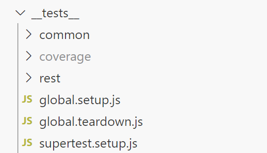

Deze map bevat: 
- `global.setup.js`: hier wordt een Prisma instantie gemaakt voor de testen (zonder dat de server gemaakt moet worden) en vier members, waarvan twee admins aan de databank toegevoegd. 
- `global.teardown.js`: hier wordt de databank volledig leeggemaakt en wordt de Prisma instantie stopgezet. 
- `supertest.setup.js`: hier worden de loginAdmin, loginMember en withServer gemaakt die later gebruikt worden in de testen voor de authenticatie. 

#### Rest folder 
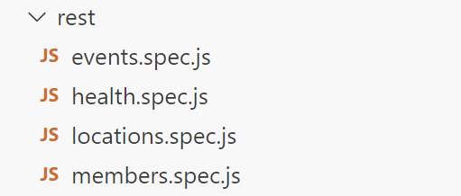

Deze map bevat: 
- `events.specs.js`: bevat de testen voor nodige API-calls naar een url beginnend met 'api/events'. 
- `health.specs.js`: bevat de testen voor nodige API-calls naar een url beginnend met 'api/health'. 
- `locations.specs.js`: bevat de testen voor nodige API-calls naar een url beginnend met 'api/locations'. 
- `members.specs.js`: bevat de testen voor nodige API-calls naar een url beginnend met 'api/members'. 

### Configuration folder 
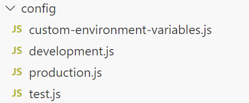

Deze map bevat: 
- `custom-environment-variables.js`: geeft aan welke environment variables moeten worden ingesteld. 
- `development`: variabelen die dienen gebruikt te worden in een development environment. 
- `production`: variabelen die dienen gebruikt te worden in een production environment. 
- `test`: variabelen die dienen gebruikt te worden in een test environment. 

### Prisma folder - datalaag
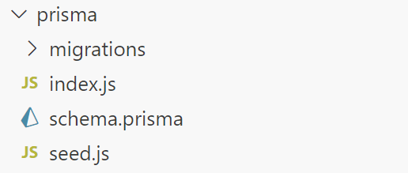

Deze map bevat: 
- `schema.prisma`: Het prisma schema , waarin de lay-out van de databank beschreven wordt. 
- `index.js` : Waar de initialisatie, de shutdown en het opvragen van de Prisma instantie gebeuren. Om optimaal te functioneren moet het aantal verschillende Prisma instanties die tegelijk gebruikt worden beperkt worden. 
- `seed.js`: waarin de seeding van de databank via Prisma gebeurd. Dit bestand wordt aangeroepen met het commando `npx prisma db seed` omdat het path naar dit bestand is opgeslagen in `package.json` als `prisma.seed`. 
- `migrations` folder: deze wordt automatisch gegenereerd en aangevuld na het opstellen of aanpassen van het schema.prisma en vervolgens uitvoeren van het commando `npx prisma dev migrate --name <name>`. 

### Source folder
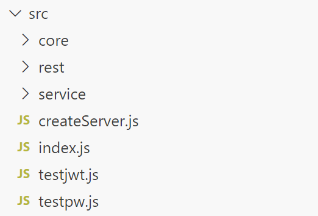

Deze map bevat: 
- `index.js`: Hierin wordt eerst de server gemaakt door createServer aan te roepen en vervolgens de server gestart. Bij het afsluiten wordt hier de stop functie van createServer aangeroepen. Bij een probleem wordt exit code -1 gegeven. 
- `createServer`: Hierin worden de logger en de databank connectie geïnitialiseerd en de app gemaakt. 
- `testjwt`: Bestand voor het uittesten van de werking van JWT, gebruiken met het commando `node src/testjwt.js`.
- `testpw`: Bestand voor het uittesten van de wachtwoord versleuteling, gebruiken met het commando `node src/testpw.js`.

#### Core folder 
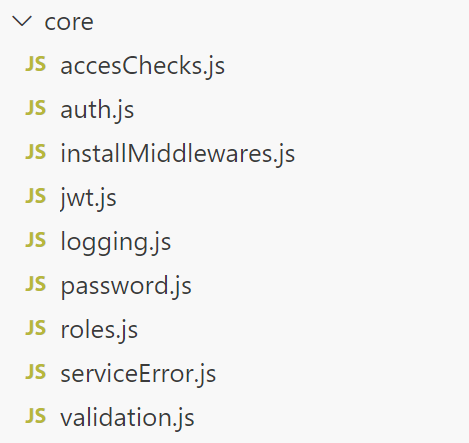

Deze map bevat: 
- `accesChecks.js`: bevat enkele functies die het controleren van de toegang vergemakkelijken. 
- `auth.js`: bevat de functies requireAuthentication en makeRequireRole, die respectievelijk controleren of een gebruiker aangemeld moet zijn en of een bepaalde rol vereist is. 
- `installMiddlewares.js`: installeert de middlewares in volgorde: cors, validation, bodyparser, security headers, foutafhandeling. 
- `jwt.js`: bevat de functies generateJWT en verifyJWT zodat JWT tokens kunnen worden gegenereerd en gecontroleerd. 
- `logging.js`: bevat de functies initializeLogger en getLogger zodat de logging kan gebruikt worden doorheen de applicatie. 
- `password.js`: bevat de functies hashPassword en verifyPassword, zodat een password dat een lid kiest kan worden gehasht voor het opgeslagen en zodat een wachtwoord waarmee een gebruiker probeert aan te melden gecontroleerd kan worden. 
- `roles.js`: hier worden de mogelijke rollen opgeslagen. 
- `serviceError.js`: hier worden de service errors gedefineerd: NotFound (het bestaat niet), ValidationFailed (er was een fout bij de invoer van de gebruiker), Unauthorized (authenticatie is vereist), Forbidden (deze gebruiker mag deze actie niet uitvoeren)
- `validation.js`: hier wordt de validate functie uitgevoerd die gebruikt wordt om de validationScheme voor invoervalidatie te controleren. 

#### Rest folder - restlaag 
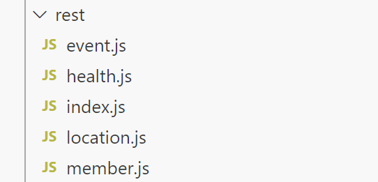

Deze map bevat: 
- `index.js`: hier wordt een router gemaakt met de prefix '/api' en worden vervolgens de routers geïnstalleerd voor de event router, member router, location router en health router
- `event.js`: hier wordt een event router gemaakt met de prefix '/events', er wordt invoervalidatie en authenticatiecontrole en indien van toepassing een corresponderende functie uit de servicelaag aangeroepen. 
- `health.js`: hier wordt een event router gemaakt met de prefix '/health', er wordt invoervalidatie en authenticatiecontrole en indien van toepassing een corresponderende functie uit de servicelaag aangeroepen. 
- `location.js`: hier wordt een event router gemaakt met de prefix '/locations', er wordt invoervalidatie en authenticatiecontrole en indien van toepassing een corresponderende functie uit de servicelaag aangeroepen. 
- `member.js`: hier wordt een event router gemaakt met de prefix '/members', er wordt invoervalidatie en authenticatiecontrole en indien van toepassing een corresponderende functie uit de servicelaag aangeroepen. 

#### Service folder - servicelaag 
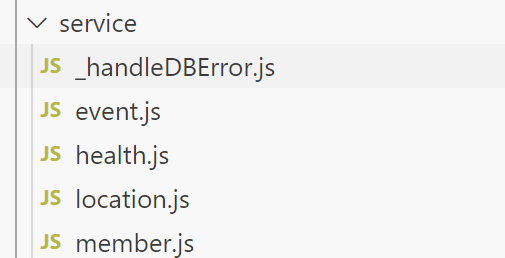

Deze map bevat: 
- `event.js`: definieert de functies die gebruikt worden in de event router en maakt daarbij gebruik van Prisma. Er wordt gecontroleerd op toegang en op of bepaalde instanties al dan niet bestaan om zo veel mogelijk databank fouten te vermijden. Deze worden anders opgevangen. 
- `location.js`: definieert de functies die gebruikt worden in de location router en maakt daarbij gebruik van Prisma. Er wordt gecontroleerd op toegang en op of bepaalde instanties al dan niet bestaan om zo veel mogelijk databank fouten te vermijden. Deze worden anders opgevangen. 
- `member.js`: definieert de functies die gebruikt worden in de member router en maakt daarbij gebruik van Prisma. Er wordt gecontroleerd op toegang en op of bepaalde instanties al dan niet bestaan om zo veel mogelijk databank fouten te vermijden. Deze worden anders opgevangen. 
- `health.js`: definieert de functies die gebruikt worden in de health router. 
- `_handleDBError.js`: definieert enkele mogelijke databank fouten die kunnen voorkomen in de servicelaag. 

## Extra technologie - Web Services

### Prisma ORM
[Prisma ORM npm package](https://www.npmjs.com/package/prisma)

Een *Object Relational Mapper* (ORM) is een manier om met je databank te communiceren, zonder zelf SQL queries te moeten schrijven. Dit zorgt ervoor dat je object-oriënted kan blijven programmeren en dus niet zelf moet denken aan tabellen of keys. Er is amper voorkennis over databanken meer nodig om toch je data in een databank op te slaan. ([Meer info over ORMs](https://www.prisma.io/dataguide/types/relational/what-is-an-orm))

#### Hoe werkt Prisma? 
In Prisma definieer je je modellen in een schema, elk model geef je de nodige attributen en relaties mee. 

Prisma vertaalt dat schema naar een `migration.sql` bestand, een SQL-bestand dat je tables, columns, primary en foreign keys zo instelt als in het schema beschreven. Dat bestand wordt opgeslagen in de [map `migrations`](#prisma-folder---datalaag) in een map met het tijdstip waarop de migration gemaakt werd en een naam die je zelf meegeeft. 

Als je later aanpassingen wilt maken aan je schema, kan je simpelweg een nieuwe migratie laten maken door Prisma die de SQL commando's bevat om je vorige databank lay-out aan te passen naar degene die je hebt beschreven in je schema. 

Wanneer je de databank `deployed` in een nieuwe, lege databank, zal Prisma ervoor zorgen dat alle migraties in chronologische volgorde worden uitgevoerd, zodat de uiteindelijke databank er precies zo uitziet als het schema beschrijft. Prisma houdt ook een tabel bij `_prisma_migrations`, die bijhoudt welke migrations zijn uitgevoerd op de databank. Als je later op dezelfde databank volgende migrations wilt uitvoeren zal Prisma controleren vanaf welke migratie moet worden uitgevoerd. ([Meer informatie over het deployen van aanpassingen aan de databank](https://www.prisma.io/docs/orm/prisma-client/deployment/deploy-database-changes-with-prisma-migrate))

Indien de databank niet leeg is voor je je migraties toepast, kan je de optie `reset` gebruiken. Dit verwijderd alle aanwezige data en dabank lay-out en past elke migration in de migrations map toe. 

Prisma kan ook gebruikt worden voor seeding (zie `prisma/seed.js`). Daarbij wordt de Prisma functie `upsert` gebruikt, die controleert of de data al in de databank staat en deze anders toevoegt. Het is beangrijk om in de `package.json` prisma.seed in te stellen op hetpad naar het bestand dat de seeding bevat. ([Meer info over seeding met Prisma](https://www.prisma.io/docs/orm/prisma-migrate/workflows/seeding))

#### Veelgebruikte commando's 

| Commando                                | Taak                                          | 
| --------------------------------------- | --------------------------------------------- |
| `npx prisma format`                     | Het schema formatteren en controleren op syntax fouten  |
| `npx prisma migrate dev --name <NAME>`  | Nieuwe migratie genereren en een naam geven   |
| `npx prisma mirgate deploy`             | Niet uitgevoerde migraties uitvoeren op de databank |
| `npx prisma db seed`                    | Seeding uitvoeren                             |

## Testresultaten - Web Services

Er zijn testen geschreven voor elke [vereiste API-call](#api-calls). Waar nodig zijn validatie en authenticatietesten toegevoegd. Elke service error die kan gegooid worden in de servicelaag wordt getest. 

### Uitvoering 
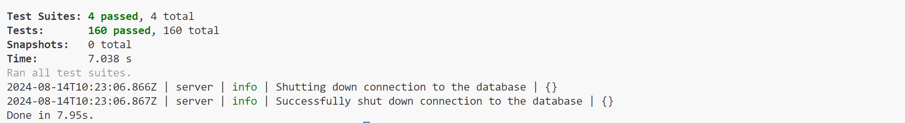

### Coverage 

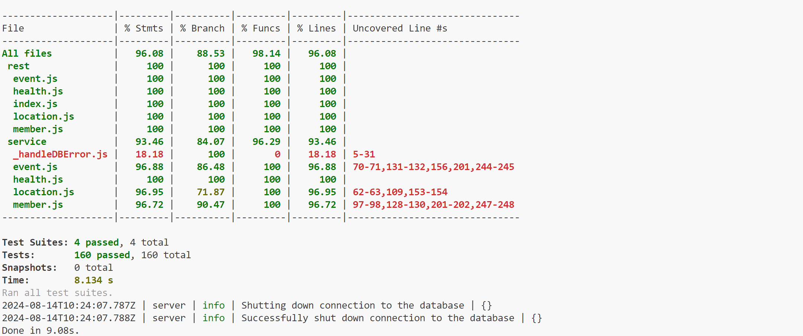

## Gekende bugs - Web Services

#### Expired token - opgelost
Wanneer het JWT token vervallen is, wordt geen gepaste melding gegeven, maar een internal server error. 

Opgelost door een service error 440 'Login Time-Out' toe te voegen. Dit kon ook een 401 'Unauthorized' zijn met een gepaste message, maar dat is niet volledig hetzelfde. ([Lijst van HTTP status codes](https://en.wikipedia.org/wiki/List_of_HTTP_status_codes#4xx_client_errors))

#### Uniek adres - opgelost 
Bij de locaties zijn enkel de id's uniek, eigenlijk zou de combinatie van city, street en number ook uniek moeten zijn. 

Opgelost door `@@unique` contraint to te voegen aan mijn Prisma schema en extra controles in te voeren in de servicelaag in location. 

## Wat is er verbeterd/aangepast? - Web Services

Dit project voldoet wel aan de minimumvereisten. De API is functioneel, online, heeft voldoende test coverage, een uitgebreid dossier en een extra technologie. 
