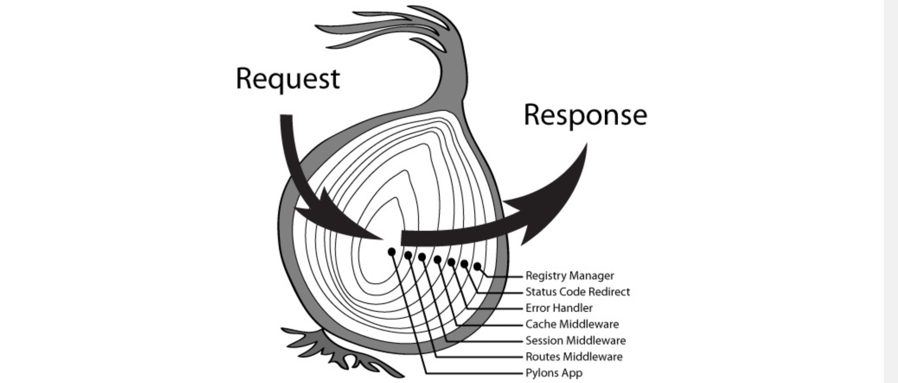

# Voorbereiding Examenvragen 

> Mona Dierickx
> EP 3 

## Vraag 1 - Toon en bespreek 2 à 3 van de testen die je geschreven hebt. 
--> zie `__tests__/rest/*.js`

## Vraag 2
### Wat zijn de conventies om een API RESTful te noemen? 
1. Uniforme interface

- Identificatie van resources.
- Manipulatie van resources door representations (JSON, XML...).
- Zelf-omschrijvende berichten.
- Hypermedia als de drijvende kracht van de applicatie status. De applicatie in deze context is de web applicatie die je server draait, hypermedia de hyperlinks/links die de server meestuurt in het antwoord. 

2. Client/server-architectuur 

de clients van de API gebruiken HTTP calls om een resource te vragen (een GET-methode) of data naar de server te sturen (een PUT, POST of DELETE-methode). De client moet voldoende hebben aan de verschillende URI's voor alle resources. De documentatie van de API bevat de beschikbare URI's/methoden die door de API worden ondersteund. De client en de server moeten onafhankelijk van elkaar kunnen evolueren. Door de gebruikers interface te scheiden van de opslag, kan een gebruikersinterface voor meerdere platformen gebouwd worden.

3. Stateless 

een stateless applicatie houdt geen verbinding in stand en slaat geen informatie op tussen requests van dezelfde client. Een client doet een request, de API voert de actie uit die in het request is gedefinieerd en reageert. Zodra de API reageert, verbreekt hij de verbinding en bewaart hij geen informatie over de client in het actieve geheugen. De API behandelt elke request als een eerste request. Dit betekent dat ieder request van client naar server alle nodige informatie moet bevatten om het verzoek te begrijpen en kan geen gebruik maken van enige opgeslagen context op de server. De sessie-status wordt volledig op de client opgeslagen.

4. Cacheable 

een REST API moet caching van vaak gevraagde data mogelijk maken. Om bandbreedte, vertraging (= latency) en serverbelasting te verminderen moet een API identificeren wat cacheable resources zijn, wie ze kan cachen en hoelang ze in de cache kunnen blijven. 

5. Gelaagd systeem 

een API kan meerdere lagen hebben, zoals proxyservers of load balancers, en de eindpuntserver kan extra servers inzetten om een response te formuleren. De client weet niet welke server op het request reageert. Met een gelaagd systeem is een API eenvoudiger uit te breiden en dus schaalbaarder. 

### Welke heb je toegepast in jouw project en waarom? 
1. [x] Uniforme interface --> overzichtelijk 
2. [x] Client/server-architectuur --> Door de gebruikers interface te scheiden van de opslag, kan een gebruikersinterface voor meerdere platformen gebouwd worden. 
3. [x] Stateless --> eenvoudiger, betrouwbaarder en robuster (geen info verloren bij crash) 
4. [ ] Cacheable 
5. [x] Gelaagd systeem --> Met een gelaagd systeem is een API eenvoudiger uit te breiden en dus schaalbaarder. 

### Waarom heb je de andere niet toegepast? 

Cashable -> was geen deel van de opgave en doordat er nooit een probleem was met serverbelasting heb ik er zelf niet aan gedacht. 

De inhoud van de app is dynamisch, waardoor cashing een risico op het tonen van verouderde data met zich zou meebrengen. Daarbij is een cache beheren complexer en gezien in de app ook geheime informatie (wachtwoord hashes, ...) worden bijgehouden zou dit de cashing nog complexer gemaakt hebben. 

## Vraag 3 
### Wat zijn NodeJS en Koa? 
#### NodeJS
- cursus

"Node.js is "Server side JavaScript", het kwam uit in 2009. Het is een single-threaded, open source, platformonafhankelijke runtime-omgeving gebouwd bovenop v8, de JavaScript engine van Chrome (werd open source in 2008). Meer info op https://kinsta.com/nl/kennisbank/wat-is-node-js/.

NPM is het package ecosysteem van Node.js. Het is het grootste ecosysteem van alle open source bibliotheken ter wereld."

- kennisbank

> "een runtime-omgeving die alles bevat wat nodig is om een programma uit te voeren dat in JavaScript is geschreven."

- perplexity

"Node.js is een open-source, platformonafhankelijke JavaScript-runtime-omgeving die is gebouwd op de V8-engine van Google Chrome. Het stelt ontwikkelaars in staat om JavaScript buiten de browser uit te voeren, wat betekent dat ze server-side applicaties kunnen bouwen met dezelfde taal die ze voor de client-side gebruiken. Dit creëert een "JavaScript overal"-paradigma, wat de ontwikkeling van webapplicaties vereenvoudigt door de noodzaak voor verschillende programmeertalen voor client- en server-side scripting te elimineren.

Kenmerken van Node.js: 
- Schaalbaarheid: Node.js is ontworpen om een groot aantal gelijktijdige verbindingen te verwerken, wat het zeer schaalbaar maakt.
- Snelheid: Het maakt gebruik van een niet-blokkerende I/O-modus, wat de prestaties verbetert.
- Grote community en ecosysteem: Er zijn meer dan een miljoen beschikbare pakketten via npm, wat de ontwikkeling vergemakkelijkt."

#### Koa 
cursus: "Koa is niet meer dan een grote 'ketting' van zogeheten middleware functies. Het idee is dat je allemaal verschillende functies definieert die elk een (kleine) taak op zich nemen, en dat die functies in een bepaalde volgorde geïnstalleerd worden in de Koa applicatie."

perplexity: "
Koa is een webframework dat is ontwikkeld door het team achter Express.js. Het is ontworpen om een kleinere, meer expressieve en robuuste basis te bieden voor webapplicaties en API's. Koa maakt gebruik van JavaScript-generators, waardoor het mogelijk is om callbacks te vermijden en de foutafhandeling te verbeteren. In tegenstelling tot andere frameworks, zoals Express, bundelt Koa geen middleware in de kern, wat ontwikkelaars meer vrijheid geeft om hun applicaties aan te passen.

Kenmerken van Koa: 
- Minimalistisch: Koa biedt een elegante set methoden voor het schrijven van servers, zonder de overhead van ingebouwde middleware.
- Modulariteit: Ontwikkelaars kunnen middleware toevoegen op basis van hun specifieke behoeften, wat leidt tot meer controle over de applicatiearchitectuur.
- Verbeterde foutafhandeling: Door gebruik te maken van async/await en generators, maakt Koa het eenvoudiger om fouten te beheren zonder in de zogenaamde "callback hell" terecht te komen." 

> In samenvatting, Node.js biedt de runtime-omgeving voor het uitvoeren van JavaScript op de server, terwijl Koa een framework is dat bovenop Node.js is gebouwd om de ontwikkeling van webapplicaties te vergemakkelijken met een focus op eenvoud en flexibiliteit.

### Leg kort de werking van middlewares uit a.d.h.v. een voorbeeld uit jouw code. 
cursus: "Elke middleware functie voert dan zijn deel van het werk uit en roept vervolgens gewoon de next-functie aan. De volgende functie kan dan verder werken met het bewerkte resultaat tot nu toe, tot de laatste middleware, die het antwoord terug geeft."

```js
// src/core/installMiddlewares.js

//... 

module.exports = function installMiddleware(app) {

    // cors 

    app.use(
        koaCors({
            origin: (ctx) => {
                if (CORS_ORIGINS.indexOf(ctx.request.header.origin) !== -1) {
                    return ctx.request.header.origin;
                }
                return CORS_ORIGINS[0];
            },
            allowHeaders: ['Accept', 'Content-Type', 'Authorization'],
            maxAge: CORS_MAX_AGE,
        }),
    );

    // validation 

    app.use(async (ctx, next) => {
        getLogger().info(`${emoji.get('fast_forward')} method: ${ctx.method} url: ${ctx.url}`);

        const getStatusEmoji = () => {
            if (ctx.status >= 500) return `${emoji.get('skull')} schuld van de server`;
            if (ctx.status >= 400) return `${emoji.get('x')} schuld van de client`;
            if (ctx.status >= 300) return emoji.get('rocket');
            if (ctx.status >= 200) return `${emoji.get('white_check_mark')} succesvol request`;
            return emoji.get('rewind');
        };

        try {
            await next();

            getLogger().info(
                `${getStatusEmoji()} ${ctx.method} ${ctx.status} ${ctx.url}`,
            );
        } catch (error) {
            getLogger().error(
                `${emoji.get('x')} ${ctx.method} ${ctx.status} ${ctx.url}`,
                {
                    error,
                },
            );

            throw error;
        }
    });

    // bodyparser

    app.use(bodyParser());

    // Add some security headers
  
    app.use(koaHelmet());

    // foutafhandeling 

    app.use(async (ctx, next) => {

        try {
            await next(); // gebeurt pas op de terugweg 
        } catch (error) {

            getLogger().error('Error occured while handling a request', { error });
            let statusCode = error.status || 500;
            let errorBody = {
                code: error.code || 'INTERNAL_SERVER_ERROR',
                message: error.message,
                details: error.details || {},
                stack: NODE_ENV !== 'production' ? error.stack : undefined,
            };

            if (error instanceof ServiceError) {
        
                if (error.isValidationFailed) {
                    statusCode = 400;
                }

                if (error.isUnauthorized) {
                    statusCode = 401;
                }

                if (error.isForbidden) {
                    statusCode = 403;
                }

                if (error.isNotFound) {
                    statusCode = 404;
                }

                if (error.loginTimeOut) {
                    statusCode = 440;
                }
            }

            ctx.status = statusCode;
            ctx.body = errorBody;
        }
    });

    // Handle 404 not found with uniform response
    app.use(async (ctx, next) => {
        await next();

        if (ctx.status === 404) {
            ctx.status = 404;
            ctx.body = {
                code: 'NOT_FOUND',
                message: `Unknown resource: ${ctx.url}`,
            };
        }
    });
};

```

> CORS is een HTTP-functie waarmee een webapplicatie, die wordt uitgevoerd onder één domein, toegang kan krijgen tot resources in een ander domein. 

### Wat is er speciaal aan middlewares in Koa? 
In Koa kan je tweemaal in elke middleware komen: zowel voor als na de aanroep van `next()`. Dit is het "onion model". 


### Wat is bv. het verschil tussen await next() en return next() in een middleware? 
Bij `await next()` wordt op de volgende middleware gewacht en daarna wordt de rest van de code in de huidige functie uitgevoerd. Deze gebruik je als je op de "terugweg" nog iets wilt doen. 
Bij `return next()` wordt niet gewacht, de functie is afgelopen en roept simpelweg `next()` aan en zal daarna geen code meer uitvoeren. Deze gebruik je als je op de "terugweg" niets meer moet doen, want dan wordt deze middleware gewoon overgeslaan. 

## Vraag 4 - Leg, a.d.h.v. een voorbeeld uit jouw code, kort uit hoe routing werkt. 
"Routing is een essentieel concept in netwerken en webontwikkeling, waarbij het de weg beschrijft die gegevens of verzoeken volgen om hun bestemming te bereiken."

- koa-bodyparser is een middleware dat we moeten toevoegen voor Koa bij onze routes aankomt. Het zal de request body parsen voor ons.
- @koa/router is ook een middleware en zal de routing op zich nemen. M.a.w. het zal de juiste code uitvoeren als bv. een POST /api/events toekomt op de server. 

De routing hier gebeurd als volgt: 
Neem bijvoorbeeld de request "GET api/events". 

Bij het maken van de server wordt routing geïnstalleerd. 

```js
// src/createServer.js

// ... 

const installRest = require('./rest');

// ... 

module.exports = async function createServer() {

    // logger 

    // ... 

    // connectie met datalaag 

    // ... 

    // app maken 

    const app = new Koa();

    installMiddleware(app);

    installRest(app);

    //...
}

```

De src/rest/index.js zal de "parent route" maken. Hier worden de request naar de juiste router (event, member, health or location) doorgegeven, afhankelijk van hun inhoud. In ons voorbeeld is dat de eventRouter. 

```js
// src/rest/index.js

const Router = require('@koa/router');

const installHealthRouter = require('./health');
const installEventRouter = require('./event');
const installMemberRouter = require('./member');
const installLocationRouter = require('./location');

/**
 * Install all routes in the given Koa application.
 *
 * @param {Koa} app - The Koa application.
 */

module.exports = (app) => {
    const router = new Router({
        prefix: '/api',
    });

    installEventRouter(router);
    installMemberRouter(router);
    installHealthRouter(router);
    installLocationRouter(router);

    app.use(router.routes())
        .use(router.allowedMethods());
};

```

In `src/rest/event.js` wordt de event router gemaakt met alle nodige API-calls naar api/events. Voor het voorbeeld is dat `GET api/events/` daarvoor worden in volgorde de functies `validate(getAllEvents.validationScheme)` en `getAllEvents` aangeroepen. Validate zal de invoer controleren. In dit geval moet de body leeg zijn. GetAllEvents zal de service laag aanspreken om alle events terug te krijgen. 

```js
// src/rest/event.js

// ...


const getAllEvents = async (ctx) => {
    ctx.body = await eventService.getAll();
};

getAllEvents.validationScheme = null;

// ...

/**
 * Install Event routes in the given router.
 *
 * @param {Router} app - The parent router.
 */
module.exports = (app) => {
    const router = new Router({
        prefix: '/events',
    });

    router.use(requireAuthentication);

    router.get('/',
        validate(getAllEvents.validationScheme),
        getAllEvents,
    );

    // ...

    app.use(router.routes())
        .use(router.allowedMethods());
};
```

## Vraag 5 
### Welke mogelijkheden zijn er op het gebied van datalaag in NodeJS? 
1. zelf queries schrijven 
2. querybuilder 
3. ORM (Object Relational Mapper) 

### Wanneer kies je voor elke mogelijkheid? 
#### 1. zelf queries schrijven 
- (grondige) kennis van SQL vereist
- queries in string-vorm
- je krijgt pure resultaten uit de databank terug (relaties zelf groeperen in aggregaten...)
- ideaal voor kleine applicaties

#### 2. querybuilder 
> Afhankelijk van het gekozen framework zijn relaties al dan niet ondersteund. Echter blijft de ondersteuning beperkt aangezien deze frameworks focussen op het bouwen van queries en niet op het eenvoudig maken van bepaalde OO-concepten in databanken. Vaak moet je dus zelf nog je relaties (en bijbehorende referentiële integriteit) afhandelen om een consistente databank te hebben.
- dynamisch queries opbouwen
- soms ondersteuning voor eenvoudig gebruik van relaties
- nog steeds kennis van SQL vereist

#### 3. ORM (Object Relational Mapper) 
Een *Object Relational Mapper* (ORM) is een manier om met je databank te communiceren, zonder zelf SQL queries te moeten schrijven. Dit zorgt ervoor dat je object-oriënted kan blijven programmeren en dus niet zelf moet denken aan tabellen of keys. Er is amper voorkennis over databanken meer nodig om toch je data in een databank op te slaan. ([Meer info over ORMs](https://www.prisma.io/dataguide/types/relational/what-is-an-orm))

- geen kennis van SQL vereist, genereert zelf queries
- eenvoudige interface om data op te vragen of weg te schrijven
- diepgaande ondersteuning voor relaties
- model definiëren kan complex zijn

### Welke heb jij gekozen en waarom? 

Ik heb een ORM (Prisma) gekozen, omdat ik nieuwsgierig was naar of het effectief handiger zou zijn. Het leek mij dat voor mijn project dat volledig gaat over de relaties tussen de entiteiten, zonder dat het een enorm complexe of grote case is, perfect geschikt was voor een ORM. 

Ik vond het definieren van het model niet te vervelend. Ik heb even moeite gehad bij het correct instantiëren van Prisma en later bij het in productie ontrollen, verder vond ik het heel gebruiksvriendelijk. Ik ben ook eens gaan kijken naar wat er precies gebeurde in de migraties en vond dat er telkens logische SQL-code gegenereerd werd. 

### Hoe heb je dit dan geïmplementeerd?

Eerst heb ik al mijn modellen gedefinieerd in een schema en elk model de nodige attributen en relaties meegegeven. 

```prisma
// prisma/schema.prisma 

generator client {
  provider = "prisma-client-js"
}

datasource db {
  provider = "mysql"
  url      = env("DATABASE_URL")
}

model Event {
  id         Int           @id @default(autoincrement())
  start      DateTime      @default(now())
  end        DateTime      @default(now())
  locationId Int
  createdBy  Int
  location   Location      @relation(fields: [locationId], references: [id])
  creator    Member        @relation(fields: [createdBy], references: [id])
  staff      Staffmember[]
}

model Location {
  id     Int     @id @default(autoincrement())
  city   String
  street String
  number Int
  events Event[]

  @@unique([city, street, number])
}

model Member {
  id            Int           @id @default(autoincrement())
  email         String        @unique
  name          String?
  password_hash String
  roles         String
  onStaff       Staffmember[]
  createdEvents Event[]
}

model Staffmember {
  memberId Int
  eventId  Int
  member   Member @relation(fields: [memberId], references: [id])
  event    Event  @relation(fields: [eventId], references: [id])

  @@id([memberId, eventId])
}
```

Prisma vertaalt dat schema naar een `migration.sql` bestand, een SQL-bestand dat je tables, columns, primary en foreign keys zo instelt als in het schema beschreven. Dat bestand wordt opgeslagen in de directory `migrations` in een directory met het tijdstip waarop de migration gemaakt werd en een naam die je zelf meegeeft. 
-> zie: `prisma/migrations/20240811084145_init`

Als je later aanpassingen wilt maken aan je schema, kan je simpelweg een nieuwe migratie laten maken door Prisma die de SQL commando's bevat om je vorige databank lay-out aan te passen naar degene die je hebt beschreven in je schema. 
-> zie: `prisma/migrations/20240813142933_uniqueaddresses`

Wanneer je de databank `deployed` in een nieuwe, lege databank, zal Prisma ervoor zorgen dat alle migraties in chronologische volgorde worden uitgevoerd, zodat de uiteindelijke databank er precies zo uitziet als het schema beschrijft. Prisma houdt ook een tabel bij `_prisma_migrations`, die bijhoudt welke migrations zijn uitgevoerd op de databank. Als je later op dezelfde databank volgende migrations wilt uitvoeren zal Prisma controleren vanaf welke migratie moet worden uitgevoerd. Indien de databank niet leeg is voor je je migraties toepast, kan je de optie `reset` gebruiken. Dit verwijderd alle aanwezige data en dabank lay-out en past elke migration in de migrations map toe. 

Om vervolgens de data te bereiken in de servicelaag (geen repositorylaag nodig, prisma vervult die fundtie) wordt een instantie van Prisma gemaakt met initializePrisma (in `src/createServer.js`), waarna de instantie kan worden gebruikt om data te bereiken met getPrisma(). 

```js
//src/service/event.js

const { getPrisma } = require('../../prisma/index');

// ... 

const getAll = async () => {
    const prisma = await getPrisma();
    return await prisma.event.findMany({
        include: {
            location: true,
            creator: {
                select: {
                    id: true,
                    name: true,
                    email: true,
                },
            },
            staff: true,
        },
    });
};

// ... 
```

## Vraag 6 - Hoe zorg je ervoor dat enkel ingelogde gebruikers/gebruikers met een bepaalde rol een resource kunnen raadplegen? Leg uit a.d.h.v. een voorbeeld uit jouw code. 

Op elke route waar authenticatie nodig is (elke route behalve `api/members/login` en `api/members/register`) wordt de funcite `requireAuthentication` toegevoegd voor het uitvoeren van het request. 

```js
// src/core/auth.js 

const memberService = require('../service/member');

const requireAuthentication = async (ctx, next) => {
    const {authorization} = ctx.headers;
    const {authToken, ...session} = await memberService.checkAndParseSession(authorization);

    ctx.state.session = session;
    ctx.state.authToken = authToken;

    return next();
};

const makeRequireRole = (role) => async (ctx, next) => {
    const {roles = []} = ctx.state.session;

    await memberService.checkRole(role, roles);

    return next();
};

module.exports = {
    requireAuthentication,
    makeRequireRole,
};
```

Wanneer een specifieke rol nodig (hier admin) is wordt de functie `makeRequireRole` opgeroepen na de controle of de gebruiker ingelogd is en voor de invoervalidatie. 

```js 
// src/rest/member

// ... 
const requireAdmin = makeRequireRole(Role.ADMIN);

    router.get('/',
        requireAuthentication,  // is de gebruiker ingelogd? 
        requireAdmin,           // is de gebruiker admin? 
        validate(getAllMembers.validationScheme),
        getAllMembers);
// ... 
```

## Vraag 7 
### Wat is async/await? 
- De async keyword markeert een functie als asynchrone functie. Asynchrone functies altijd een Promise retourneren.
- Het await keyword kan alleen worden gebruikt binnen async functies. Het maakt de functie pauzeren totdat de bijbehorende Promise is opgelost.
- await maakt het mogelijk om asynchrone code te schrijven die er uitziet en zich gedraagt als synchrone code, zonder dat je expliciet met .then() en .catch() hoeft te werken.

### Wat is de relatie met Promises? 
async/await is semantisch gerelateerd aan het concept van coroutines en is vaak geïmplementeerd met vergelijkbare technieken. Het is bedoeld om mogelijkheden te bieden voor het programma om andere code uit te voeren terwijl het wacht op een langlopende, asynchrone taak die meestal wordt weergegeven door Promises of vergelijkbare datastructuren.

### Leg uit a.d.h.v. jouw code. 

In onderstaande voorbeeld is te zien dat `getAllOnStaffEvents` een asynchrone functie is. Dat is logisch, we moeten wachten op de data die opgehaald moet worden. De map-functie die alle OnStaff members overloopt neemt even tijd en zal daarom een "Promise" teruggeven. Vervolgs moet gewacht worden tot de Promise helemaal klaar is voor de lijst van on staff events kan worden doorgegeven. 

```js
// src/service/member.js 

// ... 
const getAllOnStaffEvents = async (memberId) => {
    const prisma = await getPrisma();

    const member = await getById(memberId);

    const eventPromises = member.onStaff.map(async ({ eventId }) => {
        return prisma.event.findUnique({
            where: { id: parseInt(eventId) },
        });
    });
    return await Promise.all(eventPromises);
};
// ... 
```

## Vraag 8 
### Toon en bespreek jouw package.json. Wat staat hier allemaal in? 
De package.json bevat alle metadata van ons project, meer in het bijzonder alle dependencies en commando's om onze app te starten. Het `yarn init` commando heeft de package.json gemaakt de root van het project. 

De package.json bevat enkele properties:

- dependencies: de packages waarvan deze applicatie gebruik maakt
- devDependencies: packages enkel nodig in development (en dus niet in productie)
- scripts: laten toe om een soort van shortcuts te maken voor scripts (bv. de applicatie starten, testen, builden voor productie, etc.)
Met een simpele `yarn install` installeren we meteen een identieke omgeving (met zowel dependencies als devDependencies) en dat maakt het handiger om in een team te werken (`yarn install --prod` installeert enkel de dependencies).

Dependencies maken gebruik van semantic versioning (lees gerust eens door de specificatie). Kort gezegd houdt dit in dat elk versienummer bestaat uit drie delen: MAJOR.MINOR.PATCH, elke deel wordt met één verhoogd in volgende gevallen:

MAJOR: wijzigingen die niet compatibel zijn met oudere versies
MINOR: wijzigen die wel compatibel zijn met oudere versies
PATCH: kleine bugfixes (compatibel met oudere versies)

In een package.json zie je ook vaak versies zonder prefix of met een tilde (~) of hoedje (^) als prefix, dit heeft volgende betekenis:

- geen prefix: exact deze versie
- tilde (~): ongeveer deze versie (zie https://docs.npmjs.com/cli/v6/using-npm/semver#tilde-ranges-123-12-1)
- hoedje (^): compatibel met deze versie

```json
//package.json
{
    "name": "webservices-project",
    "version": "1.0.0",
    "main": "src/index.js",
    "author": "mona",
    "license": "MIT",
    "dependencies": {           // packages waarvan deze applicatie gebruik maakt
        "@koa/cors": "^5.0.0",
        "@koa/router": "^12.0.1",
        "@prisma/client": "^5.17.0",
        "argon2": "^0.40.3",
        "config": "^3.3.12",
        "joi": "^17.13.3",
        "jsonwebtoken": "^9.0.2",
        "koa": "^2.15.3",
        "koa-bodyparser": "^4.4.1",
        "koa-helmet": "^7.0.2",
        "node-emoji": "1.11.0",
        "winston": "^3.13.1"
    },
    "scripts": {                // shortcuts voor scripts
        "build": "yarn install && npx prisma migrate deploy reset && npx prisma db seed",
        "start": "env-cmd nodemon",
        "test": "env-cmd -f .env.test jest --runInBand",
        "test:coverage": "env-cmd -f .env.test jest --runInBand --coverage",
        "lint": "npx eslint . --fix"
    },
    "devDependencies": {        // packages enkel nodig in development
        "@eslint/js": "^9.8.0",
        "env-cmd": "^10.1.0",
        "eslint": "9.x",
        "eslint-plugin-import": "^2.29.1",
        "globals": "^15.9.0",
        "jest": "^29.7.0",
        "nodemon": "^3.1.4",
        "prisma": "^5.17.0",
        "supertest": "^7.0.0"
    },
    "nodemonConfig": {          // zorgt ervoor dat de app automatisch herstart na aanpassingen 
        "signal": "SIGTERM",
        "ignore": [
            "node_modules/*",
            ".vscode/*"
        ],
        "delay": "80",
        "watch": [              // directory waar de aanpassing moet gebeuren 
            "config",
            "src",
            "prisma"
        ],
        "ext": "js,json",       // soort bestand waarin een aanpassing moet gebeuren 
        "legacyWatch": true,
        "exec": "node --inspect=0.0.0.0:9001 --trace-warnings src/index.js" // hoe herstarten? 
    },
    "prisma": {                 // Prisma configuratie 
        "seed": "node prisma/seed.js" // bestand met seeds 
    },
    "engines": {                // nodige versies zodat het kan draaien 
        "npm": ">=9.8.0",
        "node": ">=20.16.0",
        "yarn": ">=1.22.0"
    }
}
```

### Wat is het verschil tussen dependencies en devDependencies?  
> Het verschil tussen **dependencies** en **devDependencies** is het moment wanneer ze gebruikt worden. De dependencies zijn nodig in productie, m.a.w. de applicatie kan niet werken zonder deze packages. De devDependencies zijn enkel nodig om bv. het leven van de developer makkelijker te maken (types in TypeScript, linting, etc.) of bevatten packages die enkel gebruikt worden at build time, of dus wanneer de applicatie (door webpack) omgevormd wordt tot iets wat browsers begrijpen.
dependencies: deze pakketten worden geïnstalleerd wanneer npm install of yarn install wordt uitgevoerd.

## Vraag 9 
### Wat is een linter? 
> Een linter is een development-tool die broncode analyseert op fouten, kwetsbaarheden en stijlproblemen om de code kwaliteit te verbeteren. 

Je kan eigen regels doorgeven aan de linter (zoals wij gedaan hebben), zodat je code netter, overzichtelijker en meer consistent in stijl is. 
De linter geeft een melding van de code die niet aan de regels voldoet. Sommige linters kunnen sommige "overtredingen" zelf aanpassen. 

### Wat is het nut ervan? 
- detecteert verkeerde syntax 
- detecteert twijfelachtig gebruik van code te detecteren (bad practices, bad code, harmful methods...)
- geschikt voor het afdwingen van een uniforme codeerstijl binnen een team van programmeurs 

## Vraag 10 
### Hoe werkt jouw datalaag? 
Prisma? 

### Hoe krijg je data in de databank in development mode? 
Prisma kan ook gebruikt worden voor seeding (zie `prisma/seed.js`). Daarbij wordt de Prisma functie `upsert` gebruikt, die controleert of de data al in de databank staat en deze anders toevoegt. Het is beangrijk om in de `package.json` prisma.seed in te stellen op hetpad naar het bestand dat de seeding bevat. ([Meer info over seeding met Prisma](https://www.prisma.io/docs/orm/prisma-migrate/workflows/seeding))

### Hoe wordt het databankschema up to date gehouden? 
"Als je later aanpassingen wilt maken aan je schema, kan je simpelweg een nieuwe migratie laten maken door Prisma die de SQL commando's bevat om je vorige databank lay-out aan te passen naar degene die je hebt beschreven in je schema. 

Wanneer je de databank `deployed` in een nieuwe, lege databank, zal Prisma ervoor zorgen dat alle migraties in chronologische volgorde worden uitgevoerd, zodat de uiteindelijke databank er precies zo uitziet als het schema beschrijft. Prisma houdt ook een tabel bij `_prisma_migrations`, die bijhoudt welke migrations zijn uitgevoerd op de databank. Als je later op dezelfde databank volgende migrations wilt uitvoeren zal Prisma controleren vanaf welke migratie moet worden uitgevoerd. ([Meer informatie over het deployen van aanpassingen aan de databank](https://www.prisma.io/docs/orm/prisma-client/deployment/deploy-database-changes-with-prisma-migrate))"

### Leg uit a.d.h.v. voorbeelden uit jouw code. 
-> zie `src/service` 

## Vraag 11 - Wat is jouw extra functionaliteit? Hoe werkt het? 

Prisma! 
-> zie dossier? 

## Vraag 12 
### Welke lagen heb je typisch in een gelaagde applicatie? 
- Restlaag
- Servicelaag
- Repositorylaag
- Datalaag 

### Welke lagen heb jij geimplementeerd? 
- Restlaag
- Servicelaag
- Datalaag 

### Wat is het nut/doel van elke laag? 
#### Restlaag 
De Restlaag (of REST API-laag) is verantwoordelijk voor het afhandelen van inkomende HTTP-verzoeken van clients (zoals webapplicaties of mobiele apps). Deze laag vertaalt de verzoeken naar de juiste acties in de applicatie.

- Routing: Bepaalt welke functie of service moet worden aangeroepen op basis van de URL en HTTP-methode (GET, POST, PUT, DELETE).
- Verwerking van verzoeken: Ontvangt en valideert gegevens van de client.
- Response-generatie: Formatteert en retourneert de resultaten aan de client, vaak in JSON-formaat.

#### Servicelaag 
De Servicelaag biedt de logica voor de applicatie en coördineert de interacties tussen de Restlaag en de Repositorylaag. Het is verantwoordelijk voor het verwerken van de businesslogica.

- Businesslogica: Bevat de regels en processen die de applicatie aansturen.
- Validatie: Controleert de gegevens voordat ze naar de Repositorylaag worden verzonden.
- Transacties: Beheert transacties en zorgt ervoor dat de gegevensintegriteit behouden blijft.

#### Repositorylaag 
De Repositorylaag fungeert als een abstractielaag tussen de Servicelaag en de Datalaag. Het is verantwoordelijk voor het beheren van de gegevensopslag en het ophalen van gegevens.

- Gegevensbeheer: Voert CRUD-operaties (Create, Read, Update, Delete) uit op de gegevens.
- Abstractie: Verbergt de details van de databasetoegang en biedt een consistente interface voor de Servicelaag.
- Caching: Kan cachingstrategieën implementeren om de prestaties te verbeteren. 

In mijn project was deze laag niet nodig, omdat de ORM het beheren van het opslaag en ophalen van gegevens voor haar rekening kon nemen. 

#### Datalaag 
De Datalaag is de laag die de daadwerkelijke gegevensopslag beheert, zoals databases of externe opslagservices. Het is verantwoordelijk voor het fysiek opslaan en ophalen van gegevens.

- Gegevensopslag: Bevat de database en definieert de structuur van de gegevens (tabellen, kolommen, etc.).
- Querying: Voert SQL-query's of andere databasemanipulaties uit op verzoek van de Repositorylaag.
- Beheer van gegevensintegriteit: Zorgt ervoor dat de gegevens consistent en betrouwbaar zijn. 

#### Summary 
> Elke laag in een gelaagde applicatie heeft een specifiek doel en verantwoordelijkheden. De Restlaag behandelt de communicatie met de client, de Servicelaag bevat de businesslogica, de Repositorylaag beheert de interactie met de gegevensopslag, en de Datalaag is verantwoordelijk voor de fysieke opslag van de gegevens. Deze gelaagde architectuur bevordert de modulariteit, onderhoudbaarheid en testbaarheid van de applicatie.

### Hoe projecteer je de lagen presentatie/domein/persistentie hierop? 
#### presentatielaag -- restlaag 
De presentatielaag is verantwoordelijk voor de interactie met de gebruiker en de presentatie van gegevens. Deze laag omvat de gebruikersinterface (UI) en de logica die de gebruikerservaring beheert. In de context van een gelaagde applicatie komt de presentatielaag overeen met de Restlaag, die de inkomende verzoeken van de client (bijvoorbeeld een webbrowser of mobiele app) afhandelt.

#### domeinlaag -- servicelaag 
De domeinlaag bevat de businesslogica van de applicatie. Dit is de laag waar beslissingen worden genomen en waar de regels van de applicatie worden gedefinieerd. Deze laag komt overeen met de Servicelaag in de gelaagde architectuur.

#### persistentielaag -- repositorylaag + datalaag 
De persistentielaag is verantwoordelijk voor het opslaan en ophalen van gegevens. Deze laag komt overeen met de combinatie van de Repositorylaag en de Datalaag in de gelaagde architectuur.

## Vraag 13 
### Hoe pak je logging aan in een applicatie? 
We gebruiken Winston als gespecialiseerde loggingsbibliotheek. 

```js
// src/core/logging.js 

const winston = require('winston');
const { combine, timestamp, colorize, printf } = winston.format;

let rootLogger;

/**
 * Get the root logger.
 */
const getLogger = () => {
    if (!rootLogger) {
        throw new Error('You must first initialize the logger');
    }

    return rootLogger;
};

/**
 * Define the logging format. 
 * We output a timestamp, context (name), level, message and the stacktrace in case of an error
 */
const loggerFormat = () => {
    const formatMessage = ({
        level,
        message,
        timestamp,
        name = 'server',
        ...rest
    }) =>
        `${timestamp} | ${name} | ${level} | ${message} | ${JSON.stringify(rest)}`;

    const formatError = ({ error: { stack }, ...rest }) =>
        `${formatMessage(rest)}\n\n${stack}\n`;
    const format = (info) =>
        info.error instanceof Error ? formatError(info) : formatMessage(info);
    return combine(colorize(), timestamp(), printf(format));
};

/**
 * Initialize the root logger.
 *
 * @param {object} options - The options.
 * @param {string} options.level - The log level.
 * @param {boolean} options.disabled - Disable all logging.
 * @param {object} options.defaultMeta - Default metadata to show.
 */
const initializeLogger = ({
    level,
    disabled = false,
    defaultMeta = {},
}) => {
    rootLogger = winston.createLogger({
        level,
        format: loggerFormat(),
        defaultMeta,
        transports: [
            new winston.transports.Console({
                silent: disabled,
            }),
        ],
    });

    return rootLogger;
};

module.exports = {
    initializeLogger,
    getLogger,
};
```

### Waarom zijn console.log, console.error, enz. niet voldoende? 
De logs worden dan niet opgeslagen. Daarbij ontbreken er... 

- log levels: de mogelijkheid om verschillende niveaus van logging te voorzien afhankelijk van de versie. (bv: in development wil je alle info, in production veel minder en in testing niet echt logging)
- structured logging formats: de logs die steeds op dezelfde manier gestructureerd zijn, zodat je snel de juiste info kan vinden. 
- timestamps 
- customizable output destinations 
- context-aware logging 

Ook zou het toevoegen van console.log()-statements in je code kan het gedrag van de applicatie beïnvloeden, vooral in asynchrone contexten. Na het debuggen zou je alle log-statements moeten verwijderen. 

### Leg uit a.d.h.v. een voorbeeld uit jouw code. 

-> zie src/core/installMiddlewares.js 
